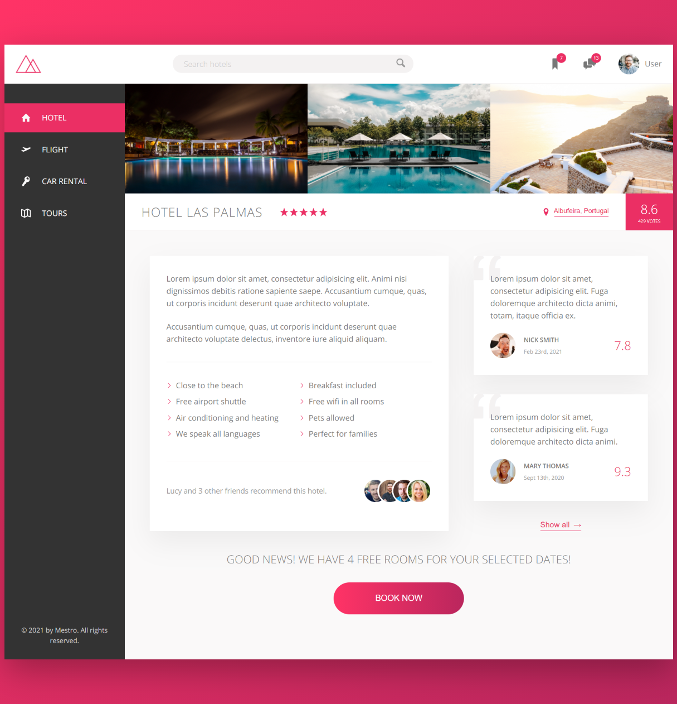
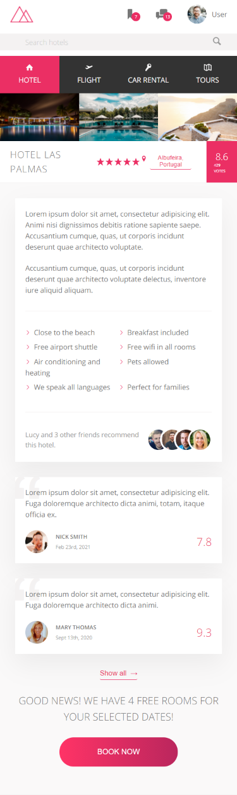
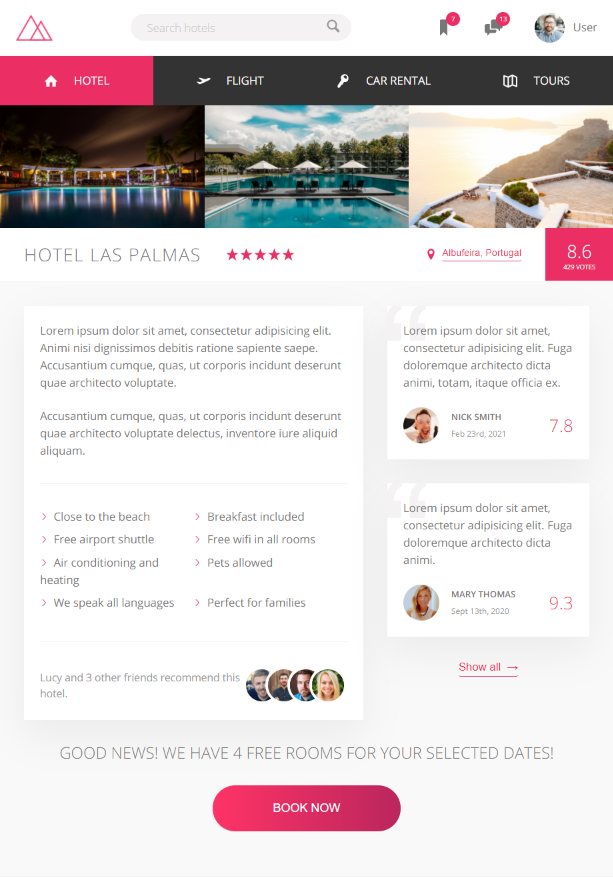

# Mestro-Landing-Page

A modern landing page to practice sass, css animation, flexbox and grid

## Bienvenue! 👋

**Pour dévelpper une page web avec une animation complexe, vous avez besoin d'une compréhension de base du HTML et du CSS. animation, grid**

## Où tout trouver?

Votre tâche consiste à construire le projet from scratch.
Mettez vos images utilisés dans :file_folder: `/img`. Vous y trouverez le fichier html sur laquelle travailler.

Voir les maquettes en format PNG dans :file_folder: `/mockup`.

## Preview
### Desktop preview

---
### Mobile preview

---
### Tablette preview

